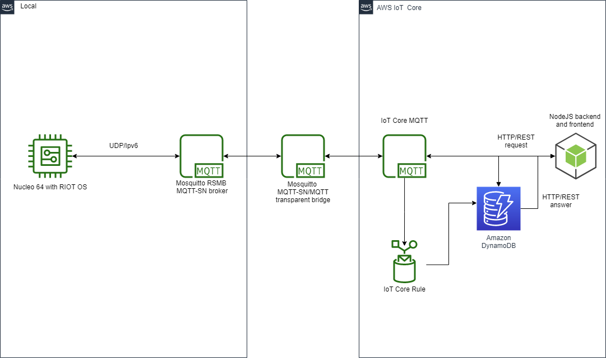

# Internet of Things 20/21 assignment one


# Smart Home

## Problem definition and why i need IoT
I want to develop an all-in-one smart monitor for my home: i would like to have the lights that turn on when i enter the room and turn off when i leave. I also want to monitor temperature
and humidity. 

## Sensors and Actuators chosen
For movement detection i used an **HC-SR501 PIR** sensor that in RIOT OS send a notification every time a movement is started or ended. The temperature and humidity will be monitored by a **DHT11 sensor**.
The actuator i chose are a **Relay** in combination with a **lightbulb** in order to turn the lights on in an automatic way and a simple **16x2 LCD display** that prints the temperature and humidity every time a movement is detected.
The DHT11 sensor polling will be event driven: when the PIR sensor detects a movement the aforementioned routine starts. DHT11 is also polled on MQTT publish every 30s. The PIR sensor is in continuous polling.

## Circuit Setup


### DHT11 temperature & humidity Sensor


[Dht module](http://doc.riot-os.org/group__drivers__dht.html) is used in RIOT OS.

#### Specs:
- Operating Voltage: 3.5V to 5.5V
- Operating current: 0.3mA (measuring) 60uA (standby)
- Output: Serial data
- Temperature Range: 0°C to 50°C
- Humidity Range: 20% to 90%
- Resolution: Temperature and Humidity both are 16-bit
- Accuracy: ±1°C and ±1%
- Polled on PIR interrupt and on MQTT advertisng.

###  HC-SR501 PIR Sensor


[PIR module](https://doc.riot-os.org/group__drivers__pir.html) used in RIOT OS for event handling.

#### Specs:
- Wide range on input voltage varying from 4.V to 12V (+5V recommended)
- Output voltage is High/Low (3.3V TTL)
- Can distinguish between object movement and human movement
- Has to operating modes - Repeatable(H) and Non- Repeatable(H)
- Cover distance of about 120° and from 3 up to 7 meters (3 meters preferred for this usage)
- Time Delay Adjust from 5 seconds to 5 minutes (5 minutes preferred for this usage).
- Low power consumption of 65mA
- Operating temperature from -20° to +80° Celsius
- The system is constant polling, waiting for event detection.


### LCD display 16x2


[HD44780 module](http://doc.riot-os.org/group__drivers__hd44780.html) used in RIOT OS for display driver.

#### Specs:
- Operating Voltage is 4.7V to 5.3V
- Current consumption is 1mA without backlight
- Alphanumeric LCD display module, meaning can display alphabets and numbers
- Consists of two rows and each row can print 16 characters.
- Each character is build by a 5×8 pixel box
- Can work on both 8-bit and 4-bit mode
- It can also display any custom generated characters
- Available in Green and Blue Backlight
- Prints Temperature and Humidity on PIR interrupt as well as a welcome message.

### Relay & Lightbulb


#### Specs:
- Supply voltage – 3.75V to 6V
- Quiescent current: 2mA
- Current when the relay is active: ~70mA
- Relay maximum contact voltage – 250VAC or 30VDC
- Relay maximum current – 10A
- Turns on bulb manually from MQTT request from dashboard or automatically from PIR interrupt

## Data Analysis and Collective Intelligence
The data coming from sensors are aggregated via RIOT OS: when PIR sensor detects a movement the relay is triggered and the bulb turns on; the lcd display prints temperature and humidity. Bulb activation can also happen manually via MQTT from the dashboard. The collective intelligence i expect is a smart way to monitor home environment, and an increase to the level of comfort and awareness.

## Connected Components

### IoT Level

#### IoT Main Device
Use the STM32 Nucleo F401RE board with RIOT OS. MQTT advertisng on "/iot/1/data" every 30 seconds with sensors data.

#### MQTT-SN RSMB broker
Config file on [this path](./config/rsmb_local.conf). It forwards from/to the transparent bridge "/iot/+/data" (from the board, and where the '+' is a wildcard for device id) and "both_direction" (from the board to AWS and to the board from AWS) topics.

### Bridge
#### MQTT-SN/MQTT Mosquitto transparent bridge
Config file on [this path](./config/m_bridge.conf). It forwards from/to IoT Core MQTT "/iot/+/data" and "both_direction" topics.

### Cloud Level

### Cloud-based IoT Backend
MQTT from IoT Core is used to recive messages from the board. With a custom [policy](./config/IoT_core_rule_wrap) on AWS data coming from topic "/iot/+/data"  with sensor data are stored on DynamoDB along with timestamp in wx_data table.

#### DynamoDB wx_data table structure
```
+-------------+-----------+-------------+
|               wx_data                 |
+-------------+-----------+-------------+
| sample_time | device_id | device_data |
+-------------+-----------+-------------+
```
### Web-based Dashboard
NodeJS based backend and Html/JavaScript dashboard, Bootstap is used for interface design. AWS api are used in order to connect to MQTT and to DynamoDB. At application startup data are are queried from DynamoDB and manually filtered and aggregated in order to diplay:

- The latest values received from all the sensors (first row on the table)
- The aggregated values (average, minimum and maximum) for each sensor during the last hour
- The values received during the last hour from all sensors
- Turn manually On/Off the bulb, by MQTT posting
- Table is updatated every 10s

#### Npm dependendencies
Npm packages used are:

- **aws-iot-device-sdk** for IoT Core MQTT
- **aws-sdk** for DynamoDB
- **express** for html communication
- **html** for starting html server


## Architecture and Network diagram



### Network Technologies used
- UDP/IPv6 with [ethos](https://api.riot-os.org/group__drivers__ethos.html) for Nucleo board
- MQTT-SN RSMB, MQTT-SN/MQTT Mosquitto bridge and IoT Core MQTT
- HTTP/REST for DB and MQTT communication.

## Quick Startup

### Warnings
- **Make sure to have AWS valid credentials saved on ~/.aws/credentials before trying to run anything.**

- **I created a /secret folder in [visualization](./visualization) folder with all credentials, for safety reasons not published on git**

- **RIOT OS needs to be already set up**

- **NodeJS and nmp needs to be already installed**

- **AWS needs to be already setup with DynamoDB table, IoT Core MQTT object and IoT Core policy for data forward from MQTT to DB**

- **RSMB broker must be on $PATH since it is started in "./start_board.sh" script, otherwise a manual start is required**.

- **MQTT-SN/MQTT Mosquitto Transparent Bridge should already be running before launching scripts**.


### Scripts

Use this bash simple scrips in order to compile the code, flash it on nucleo board, install npm dependencies and run the dashboard on localhost.

```
# install npm dependencies
./install_dependencies.sh

# runs mqtt-sn broker, builds and run project for nucleo board
./start_board.sh

# starts on default browser dashboard
./start_visual.sh

```


## Real life scenario photos

#### Light on


#### Dashboard


