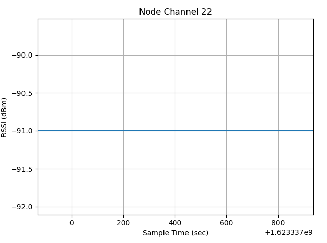
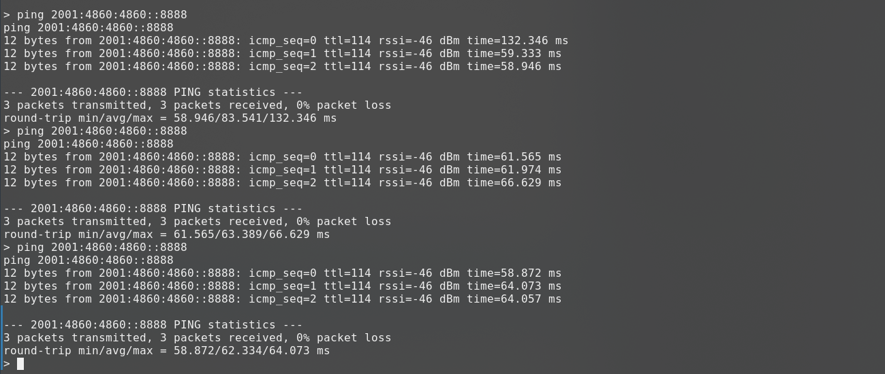
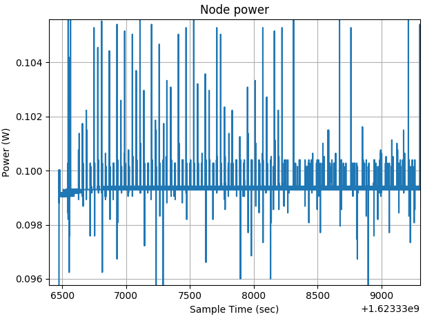
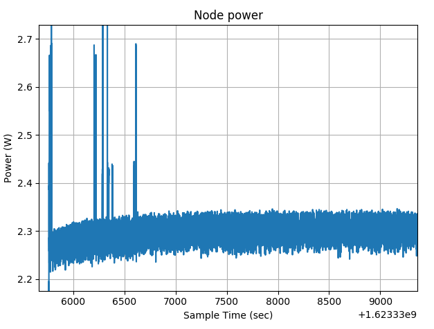

# Internet of Things 20/21 assignment two

Most of the code and the setup is the same form assignment one. If some passage is not clear see [assignment one summary](./First.md) for reference.
# Start experiment


## Commands
### SSH into Saclay

```sh
ssh <login>@saclay.iot-lab.info
```

### Start Router
In a shell prompt, after ssh run:
```sh
iotlab-auth -u <login>
git clone https://github.com/RIOT-OS/RIOT.git -b 2020.10-branch
cd RIOT
source /opt/riot.source
make ETHOS_BAUDRATE=500000 DEFAULT_CHANNEL=22 BOARD=iotlab-m3 -C examples/gnrc_border_router clean all
# Replace  the m3-1 below with the correct node assigned to you (in the screenshot case e.g. m3-9)
iotlab-node --flash examples/gnrc_border_router/bin/iotlab-m3/gnrc_border_router.elf -l saclay,m3,1 
sudo ethos_uhcpd.py m3-1 tap0 2001:660:3207:04c1::1/64
# If the address or tap are taken, try change tap number and also IPv6 :04c1: block with new numbers
```

### Start MQTT broker and bridge
In another shell prompt, before ssh, to compile and copy code to iotlab run:

```sh
# In the root folder of this repo
cd source/iotlab-m3
make all
scp bin/iotlab-m3/iot_lab_smart_home.elf login@saclay.iot-lab.info:~

# Copy config
cd ../..
scp config/m_bridge_scalay.conf login@saclay.iot-lab.info:~/A8/mosquitto.conf 
scp config/rsmb_saclay.conf login@saclay.iot-lab.info:~/A8/config.conf 

# Copy credentials
scp /etc/mosquitto/certs/private.key login@saclay.iot-lab.info:~/A8/certs/private.key
scp /etc/mosquitto/certs/cert.pem login@saclay.iot-lab.info:~/A8/certs/cert.pem
scp /etc/mosquitto/certs/rootCA.pem login@saclay.iot-lab.info:~/A8/certs/rootCA.pem

```
after ssh into iot lab, run in two different prompts:

```sh
 
 # Prompt 1 (replace a8-100 with correct number)
 ssh root@node-a8-100
 cd ~/A8
 ## Copy certs in correct folder
 cp -r certs /etc/mosquitto
 mosquitto -c mosquitto.conf
 
 # Prompt 2 (replace a8-100 with correct number)
 ssh root@node-a8-100
 cd ~/A8
 ## Edit config.conf with vim to update the IPv6 address of the machine (obtainable via ip a) and finally:
 broker_mqtts config.conf
```

### Flash smart home code on nodes
In three differnt shell prompts run,after ssh:
```sh
# Replace  the 1 with the correct node assigned to you (in the screenshot case e.g. 10-11-12)
iotlab-node --flash iot_lab_smart_home.elf -l saclay,m3,10 # and then 11 and 12  
nc m3-10 20000

# RIOT shell 
mqtt <IPv6 of A8 node> <device-id (1-3)>

```
for more info of what does the code see [here](../source/iotlab-m3/README.md)

# New dashboard


<br/><br/>

# Network Performances


<p>
 
 </p>
 <p>
    <em>Network usage via iotlab anlytics does not look like was used, but probably is due to RIOT.</em>
</p>

Infact we can see from ping statistics that the average delay with 802.15.4 mesh networking is always about 60ms, independetly from how many devices are connected to the network (up to 4 tested).

# Energy Consumption
## Main Device(s)

<p>
   
 </p><p>
    <em>This is the energy consuption on the node where my program was running: there is a clear first spike when the code is flashed on the device, and many smaller spikes on mqtt advertising.</em>
</p>

<p>
    
 </p>
 <p>
    <em>In detail the advertising phase</em>
</p>

## Router Device

<p>
    
 </p><p>
    <em>The power cosumption on the router m3 node is slightly higher: the radio module is always active</em>
</p>

## A8 Device

<p>
    
 </p><p>
    <em>On the A8 devices power consuption is generally higher than m3 due to different architecture. We can also many spikes due to MQTT SN broker and MQTT SN-MQTT Mosquitto bridge</em>
</p>

# Device and Network Scheme


<p>
   
 </p><p>
    <em>Finally here is the updated device scheme used for this second assignment. The Aws remains unchanged, despite the dashboard support for three devices at the time.</em>
</p>
