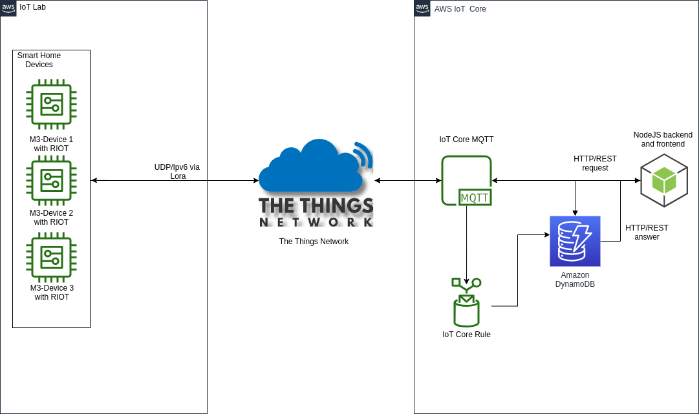
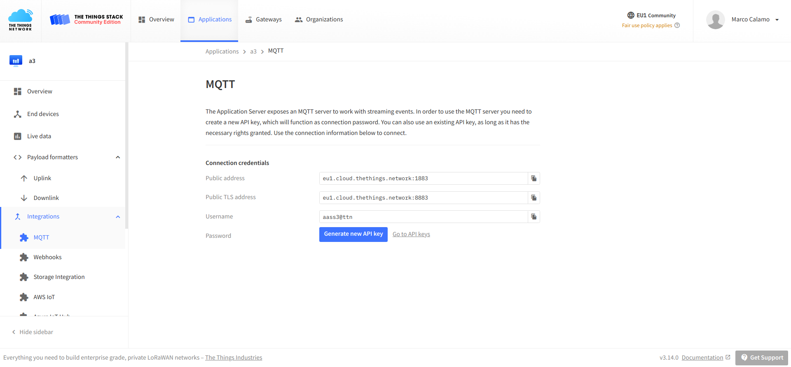
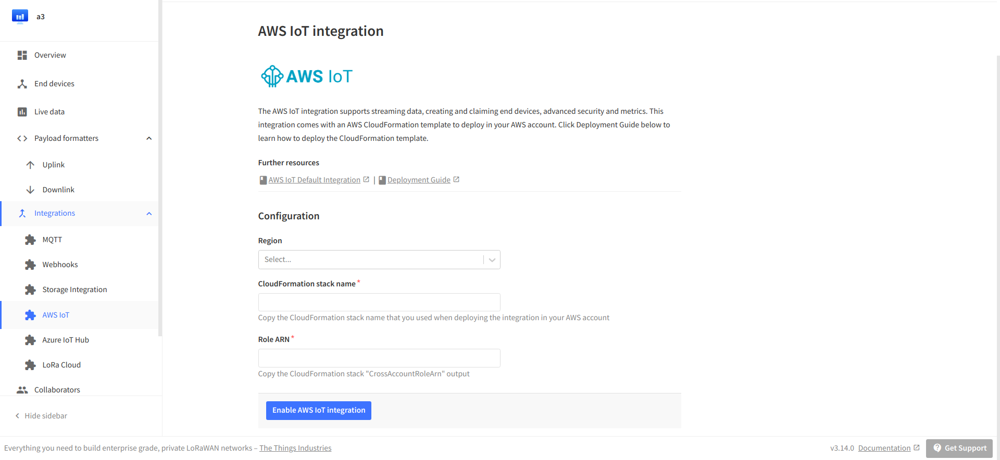

# Internet of Things 20/21 assignment three

Most of the code and the setup is the same form assignment one and two. If some passage is not clear (e.g. AWS or web interface setup or uploading firmware on IoT-LAB board) see [assignment one summary](../../first_delivery/docs/First.md) and [assignment two summary](../../second_delivery/docs/Second.md) for reference.

# Setup 

The setup of [The Things Network](https://www.thethingsnetwork.org/) can be done by following [this](https://www.iot-lab.info/legacy/tutorials/riot-ttn/index.html) tutorial.
**IMPORTANT DISCLAIMER**: right now (August 2021) the LoRa nodes on IoT-LAB are not yet able to work the new stack (v3) of The Things Network, so the connection to the platform will fail and it will not be possible to have the system fully functional

# Device and Network Scheme

# LoRaWAN Support

It was necessary to update the code in order to properly fit LoRaWAN specifications. For example packet size was reduced to the bare minimum: only up to 12 bytes (temperature [float], humidity [float], last_pir_awake [float] with no other string), removing the unnecessary infotmations.
With the **TTN** platform is possible to have direct integration with AWS :
  

  

# Dashboard

  

# Test Results
Due to the impossibility to proceed with full tests, no datas are available.

# Code
More info about the code [here](../source/b-l072z-lrwan1/README.md)

# Dashboard
More info about the dashboard [here](../visualization/README.md)
